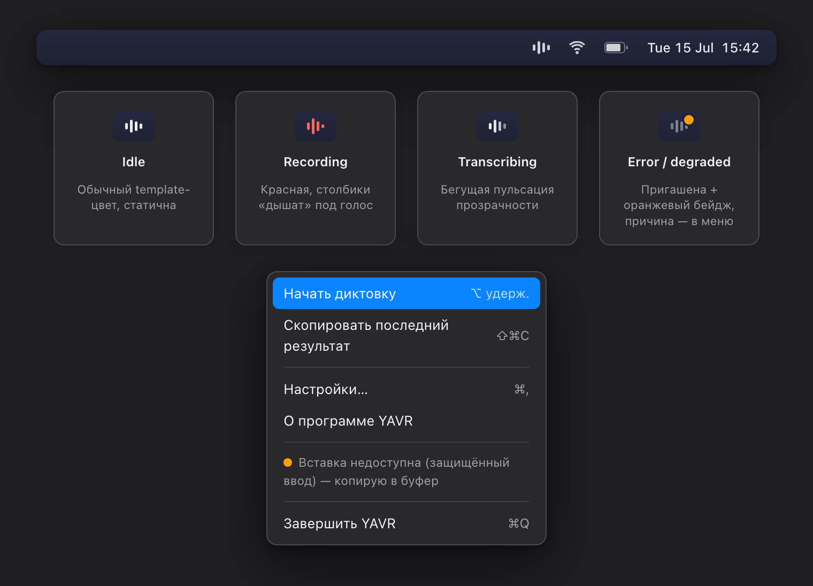
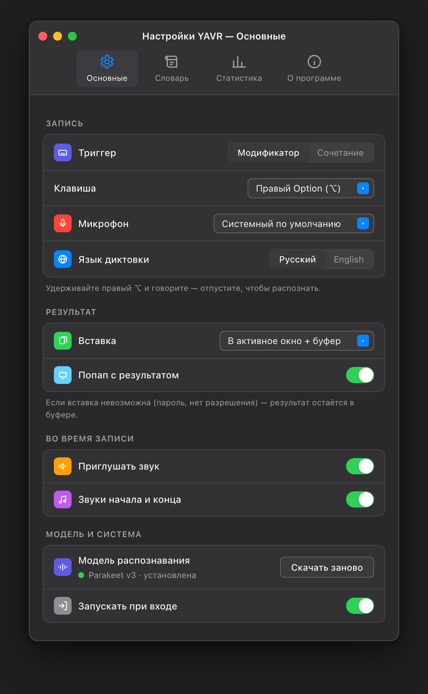
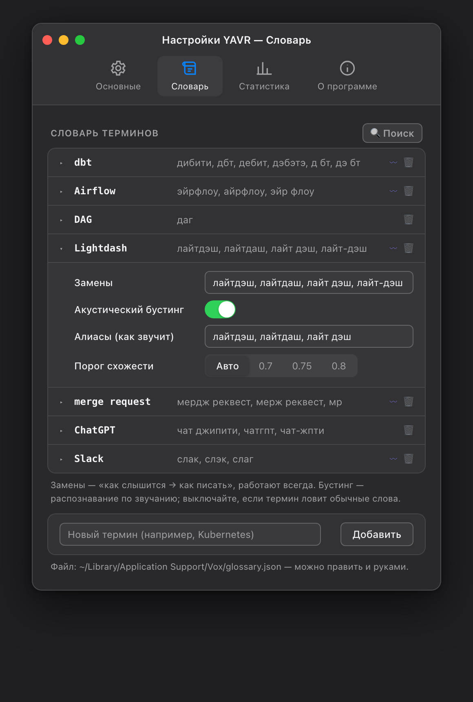
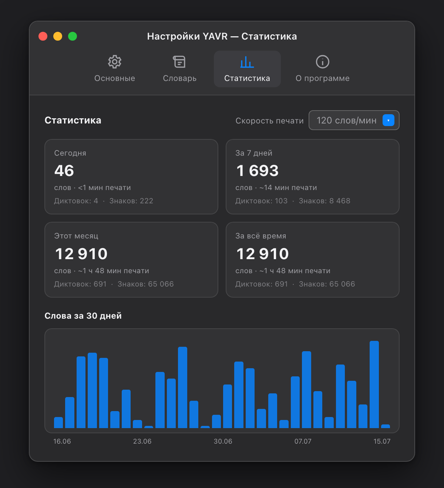

# YAVR — Yet Another Voice Recognition

Голосовая диктовка для macOS, которая пишет IT-термины латиницей: говорите
«задеплой дибити и обнови дашборд в лайтдэше» — получаете «задеплой dbt и
обнови dashboard в Lightdash». Всё распознавание — целиком на вашем Mac,
ни один байт аудио не покидает компьютер.



## Зачем

Готовые диктовочные аппы пишут английские термины кириллицей («дибити»,
«лайтдэш», «биг квери»). YAVR решает это трёхслойным пайплайном:

1. **ASR** — NVIDIA Parakeet TDT 0.6b v3 или Whisper Large v3 Turbo (CoreML);
2. **акустический бустинг терминов** (Parakeet) — CTC keyword spotting подтверждает
   термин по звучанию и заменяет искажённое распознавание («мертч реквист» →
   merge request);
3. **текстовые замены** — детерминированный словарь «как слышится → как
   писать» с падежными хвостами («в лайтдэше» → «в Lightdash») и защитой от
   ложных срабатываний (обычные русские слова не трогаются: «потом» — не
   Python, «дай» — не DAG, «часто» — не chart).

## Возможности

- Меню-бар утилита: иконка-волна с состояниями (запись — красная, распознавание — пульсирует, ошибка — оранжевый бейдж).
- Триггеры: удержание правого Option (⌥/⌘/⌃ на выбор) или кастомное сочетание клавиш — в режиме «держать и говорить» или «нажал — старт, нажал — стоп».
- Вставка результата прямо в активное окно (Slack, терминал, браузер…) + копия в буфере; при защищённом вводе — молча только буфер.
- Плавающий индикатор записи с таймером, попап с результатом (отключаемый), звуки старт/стоп, автопробел между диктовками.
- Русский и английский язык диктовки (переключение из меню).
- Редактируемый словарь терминов: из настроек или руками в JSON.
- Приглушение музыки и другого звука на время записи (возвращается само).
- Статистика: слова, диктовки, знаки и сэкономленное время печати, график за 30 дней.
- Лимит записи 5 минут, запуск при входе в систему.







## Установка

Требования: macOS 14+, Apple Silicon, ~2.5 ГБ диска (сборка + модели),
Xcode Command Line Tools (`xcode-select --install`).

```bash
git clone https://github.com/qwerned/yavr.git
cd yavr
./scripts/make-signing-cert.sh
./scripts/install.sh
```

Скрипт собирает приложение, ставит его в `/Applications/YAVR.app` и
запускает. При первом запуске onboarding проведёт по шагам: загрузка
модели (~570 МБ, докачивается после обрыва) → доступ к микрофону →
Универсальный доступ (для вставки в активное окно) → тестовая диктовка.

> Приложение подписано локальным сертификатом (без Developer ID). Если Gatekeeper
> ругается — правый клик по YAVR.app → «Открыть».

Ставите как разработчик и планируете пересобирать? Сначала создайте
локальный сертификат подписи — тогда macOS не будет забывать выданные
разрешения после каждой пересборки:

```bash
./scripts/make-signing-cert.sh && ./scripts/install.sh
```

## Выбор модели и словаря

В «Настройки → Основные → Модель и система» выберите **Parakeet v3** или
**Whisper Large v3 Turbo** и нажмите «Скачать». Выбор сохраняется после перезапуска.
Parakeet остаётся моделью по умолчанию; ранее скачанные модели сохраняются.
Whisper доступен и в первом шаге начальной настройки.

Whisper работает локально через [WhisperKit](https://github.com/argmaxinc/WhisperKit).
Используется [CoreML-версия Turbo 626MB](https://huggingface.co/argmaxinc/whisperkit-coreml/tree/main/openai_whisper-large-v3-v20240930_626MB):
около 630 МБ плюс токенизатор, дополнительное место для кэша CoreML.
Это сжатая версия модели, её размер и результаты могут отличаться от других сборок Turbo.
Загрузка и первая подготовка требуют интернета; аудио никуда не отправляется.
Доступны русский, английский и автоопределение языка (для Whisper).
CLI `yavr-cli` по-прежнему использует Parakeet.

В разделе «Результат» переключатель **«Использовать словарь»** включает или
отключает словарную обработку для обеих моделей. По умолчанию он включён.
При выключении сохраняется исходный текст ASR: без текстовых замен и без
акустического бустинга. В Whisper при включении применяются текстовые замены;
акустический CTC-бустинг доступен только для Parakeet.
В редакторе термина его бустинг включается отдельно; при выключении алиасы
сохраняются. В старых словарях бустинг считается включённым при непустых aliases.

Пока идёт распознавание, новая запись не начинается. Перенастройка горячей
клавиши во время записи применяется после её окончания.

Приложение, исполняемый файл и каталог данных называются YAVR; bundle ID —
`com.yavr.app`, сертификат — `YAVR Dev Signing`. Установщик проверяет эту
идентичность, сохраняет настройки и временно держит предыдущий `.app` для
отката. После успешного обновления предыдущий `.app` удаляется.

## Словарь терминов

Живёт в `~/Library/Application Support/YAVR/glossary.json` (копируется из
дефолтного при первом запуске), правится из настроек или руками:

```json
{
  "text": "Lightdash",                      // как писать
  "aliases": ["лайтдэш", "лайтдаш"],        // акустический бустинг
  "replacements": ["лайтдэш", "лайтдаш"],   // текстовые замены (+падежи)
  "minSimilarity": 0.75                     // необязательный порог бустинга
}
```

Правила, выстраданные тестами:

- **aliases** — только точные кириллические написания того, что реально
  выдаёт распознавание. Бустинг агрессивен: короткий термин, похожий на
  обычное слово («даг»/«дай», «чарт»/«часто»), будет ложно срабатывать —
  таким терминам алиасы не даём, оставляем только replacements.
- **replacements** безопасны: работают по границам слов, с падежными
  хвостами, регистронезависимо. Приставочные глаголы не трогаются:
  «задеплоил» останется русским.
- Русский IT-сленг («коммит», «пуш», «чарт», «метрики») сознательно не
  переводится — правьте под себя.

Правки применяются со следующей диктовки, перезапуск не нужен.

## Разработка

```bash
swift run yavr-tests        # проверки ядра приложения (121 проверка)
swift run yavr-cli --mic    # CLI: диктовка с тремя слоями вывода
```

Всё, что ставится в систему, называется одинаково: бандл `/Applications/YAVR.app`,
исполняемый файл `YAVR`, bundle id `com.yavr.app`, подпись
«YAVR Dev Signing». `install.sh` перезаписывает только собственный бандл
(сверяет bundle id) и не трогает другие приложения.

Используйте один сертификат `YAVR Dev Signing` для последующих обновлений.
После перехода с временной подписи на сертификат может потребоваться один раз
удалить устаревшую запись YAVR из «Универсального доступа», добавить текущий
`/Applications/YAVR.app` и включить разрешение.

## Атрибуция

- [FluidAudio](https://github.com/FluidInference/FluidAudio) — Apache License 2.0
- [NVIDIA Parakeet TDT 0.6b v3 (CoreML)](https://huggingface.co/FluidInference/parakeet-tdt-0.6b-v3-coreml) — CC-BY-4.0

## Проверки сборки

```bash
swift run --build-system native yavr-tests
python3 scripts/test-install.py
./scripts/make-app.sh release
```

Сборка `.app` применяет проверяемый патч совместимости к закреплённой версии
Hub: ресурсы токенизатора загружаются из `Contents/Resources`. Сам YAVR также
использует этот каталог; для запуска через SwiftPM сохраняется `Bundle.module`. Проверка `YAVR.app/Contents/MacOS/YAVR --check-installation` выполняется
без запуска интерфейса, чтения пользовательских настроек или записи звука.
Внутри `.app` запасной путь к ресурсам в `.build` отключён.
